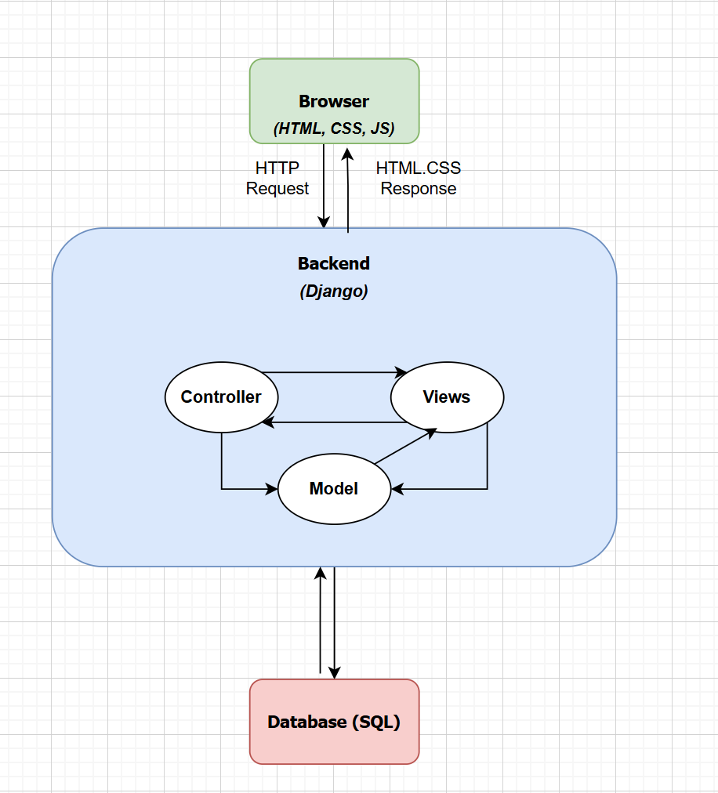

# UNITIX (SOEN-341 Project)
Campus Events &amp; Ticketing Web App 
SOEN 341

## Objective

The objective of the Campus Events & Ticketing Web Application is to provide a user-friendly platform that allows for student engagement by streamlining the discovery, organization, and participation in campus events. The system is made in a way that students can easily browse, save, and claim tickets, simplifies the check-in processes through QR codes, and gives organizers tools to create, manage, and analyze their events. It also enables administrators to ensure smooth operations through content moderation and organizational oversight. Finally, the application aims to foster better involvement in the community, improve operational efficiency, and create a larger support system to on-campus events.

## About
This project is a Campus Events & Ticketing Web Application designed to centralize event discovery, ticketing, and management within a university environment. The platform supports three main user roles—Students, Organizers, and Administrators—each with dedicated tools and permissions.

Students can browse and attend events, organizers can create and analyze events, and administrators oversee platform activity to ensure smooth and compliant operation. Built using Django for the backend and MySQL as the database, the application focuses on reliability, usability, and efficient event management.

## Features

**Student Features:** 
- Browse and explore all campus events 
- Search and filter by date, category, or organization
- View full event details (description, location, capacity, etc.)
- Save events to a personal calendar
- Claim tickets (free or mock paid)
- Receive a digital ticket generated with a unique QR code

**Organizer Features:** 
- create and manage events
- Edit, update, or delete existing events
- View an event-specific analytics dashboard: (Total tickets issued, attendance rate, etc.)
- Export attendee list as a CSV file
- Validate tickets using an integrated QR code scanner

**Administrator Features:**
- Approve or reject organizer or student account applications
- Moderate event listings for policy compliance
- View global platform statistics (Total number of events, Total tickets issued, Overall participation trends)
- Manage organizations and departments
- Assign roles (student, organizer, admin)
- Revoke or modify roles as needed
       

## Team Members
| Name                  | Student ID | GitHub Username |  
|-----------------------|------------|-----------------|
| Jana Abuhamed         | 40317183   | JanaAbuhamed    | 
| Yasmine Albouchi      | 40312832   | yasminealb      |    
| Jana Alnoman          | 40272288   | Jnom453         | 
| Lyne Seddaoui         | 40252125   | lynesdd         |   
| Christopher Liang     | 40174418   | chrix1234       |      
| Kerollos Kerollos     | 40316125   | kerollos-ke     |      
| Mohammad Alhaji       | 40264810   | mohammadalhaji  |      
  
## Tech Stack
Backend: Django (Python)

Database: MySQL

Frontend: HTML, CSS, JavaScript

Authentication: Django auth system

Version Control: Git & GitHub

CI/CD: GitHub Actions (.github/workflows/ci.yml)

## Setup Instructions
1. Clone the repo:  
    git clone <repo-url>
    cd SOEN-341-CAMPUS-EVENTS-TICKETING
2. Create and activate a virtual environment:  
    python -m venv venv  
    source venv/bin/activate     # macOS/Linux  
    venv\Scripts\activate        # Windows  
3. Install dependencies:  
    pip install -r requirements.txt  
4. Run Migrations:  
    python manage.py migrate  
    python manage.py makemigrations  
5. Create a Superuser  
    python manage.py createsuperuser  
6. Start the Development server:  
    python manage.py runserver  

## System Architecture

The **browser** represents the user interface and consists of HTML, CSS, and JavaScript. It sends HTTP GET and POST requests to the Django backend (for example, /login/).

The **backend** follows Django’s MTV (Model–Template–View) architectural pattern:

The _Model_ defines the data structure and interacts with the SQL database through Django’s ORM.

The _View_ determines how data is presented to the user in HTML.

The _Controller_ contains the application logic, processing user requests, retrieving or updating data through the Model, and rendering the appropriate Template in response.

The **SQL database** stores and manages data across various tables such as Student user, Events, and others relevant to the application.

